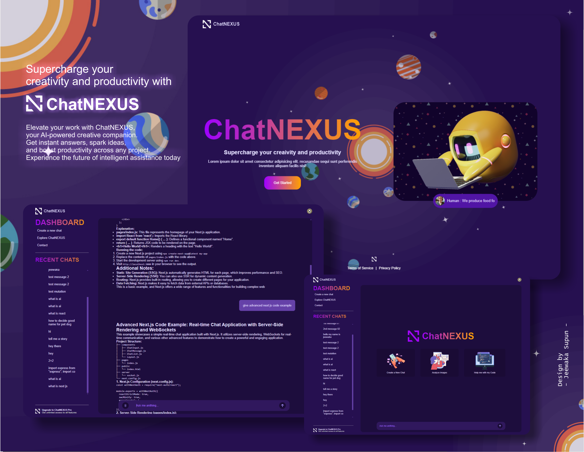

ChatNEXUS
---

ChatNEXUS is an AI-powered chat application inspired by ChatGPT, designed to supercharge your creativity and productivity. This full-stack application leverages cutting-edge technologies to provide an intelligent, responsive chatbot experience.

Features
---

AI-powered chat interface using Google's Generative AI (Gemini)
User authentication with Clerk
Real-time conversation updates
Responsive design for seamless use across devices
MongoDB integration for data persistence

Tech Stack
---
Frontend

1.React (v19.0.0-rc)
2.Vite
3.React Router Dom
4.React Query
5.SASS for styling
6.React Type Animation for dynamic text effects
7.React Markdown for rendering formatted messages

Backend

1.Node.js
2.Express.js
3.MongoDB with Mongoose
4.Clerk for authentication
5.ImageKit for image processing

Getting Started
---
Prerequisites

1.Node.js (v14 or later)
2.MongoDB instance
3.Clerk account for authentication
4.Google AI Platform account for Gemini API access

Installation

1.Clone the repository
    
2.Install dependencies for both frontend and backend:

    # Install frontend dependencies
      - cd frontend
      - npm install

3.Install backend dependencies:

    # Install frontend dependencies
      - cd ../backend
      - npm install

4.Set up environment variables:
     Create .env files in both frontend and backend directories with the necessary configuration (API keys, database URI, etc.)
     
5.Start the development servers:

     # Start backend server
        - cd backend
        - npm start
 
     # In a new terminal, start frontend development server
        - cd frontend
        - npm run dev

6.Open your browser and navigate to http://localhost:5173 (or the port specified by Vite)

License
---
This project is licensed under the ISC License.

Acknowledgements
---
Clerk for authentication
Google Generative AI for the chat AI
MongoDB for database
React and Vite for the frontend framework
All other open-source libraries used in this project

## Let's Work Together
---
I'm always open to new opportunities and collaborations. Feel free to reach out!

- 📧 Email: supunprabodha789@gmail.com
- 🔗 LinkedIn: [ https://lk.linkedin.com/in/jeewaka-supun-221780218]

---

© 2024 [Jeewaka Supun] | Web Developer and UI Designer
